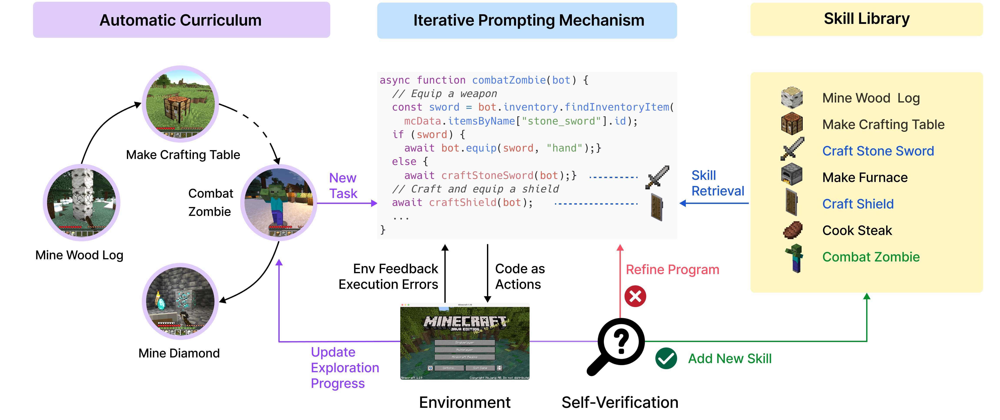

# HackPrinceton iMessage + Voyager Integration

**Control Minecraft with iMessage using AI!** 🎮📱

Send messages like "mine iron ore" or "build a house" in your iMessage chat, and watch AI play Minecraft for you.

Photon mode summary:
- Local mode: no Photon credentials required, runs against the Messages database on your Mac, DM workflows only.
- Photon cloud mode: set `PHOTON_PROJECT_ID` and `PHOTON_PROJECT_SECRET` to use managed iMessage infrastructure with group-chat creation support.

## Quick Start

```bash
# 1. Install dependencies
npm install
pip install -e .

# 2. Set your OpenAI API key
export OPENAI_API_KEY="sk-your-key-here"

# 3. Optional: enable Photon cloud iMessage
export PHOTON_PROJECT_ID="your-project-id"
export PHOTON_PROJECT_SECRET="your-project-secret"

# 4. Run the bot
npm run voyager
```

Without Photon credentials, use a DM with the bot account on your Mac. With Photon credentials configured, group chats are supported.

## Photon Orchestrator

For the approval-based local orchestration flow, run:

```bash
npm run photon
```

Photon will now:
- propose the agent plan first
- wait for you to reply `YES` or `/approve`
- keep revising the plan until you confirm it
- launch local Voyager bots only after approval
- run independent bot assignments in parallel
- send shared run memory events to Supabase (when configured)
- query Supabase memory/vector context and inject resolved locations into bot tasks
- write proposal/run tracking files to `PHOTON_TRACKING_DIR` (default: `./photon-progress`)

Useful chat commands:
- `/status`
- `/status RUN_ID`
- `/approve`
- `/override <miner|builder|forager|assignment_id> [task]`
- `/cancel`
- `/end`
- `/memory log <text>`
- `/memory find <query>`
- `/memory recent`
- `/help`

Recommended local env for this flow:

```bash
OPENAI_API_KEY=...
OPENAI_EMBEDDING_MODEL=text-embedding-3-small
VOYAGER_PATH=/absolute/path/to/voyager
VOYAGER_MC_PORT=25565
VOYAGER_SERVER_PORT=3000
VOYAGER_BOT_PREFIX=vgr
PYTHON_BIN=python3
SUPABASE_URL=...
SUPABASE_SERVICE_ROLE_KEY=...
SUPABASE_SHARED_MEMORY_TABLE=agent_memory
SUPABASE_PROJECT_ID=... # optional: overrides inferred project ref/context
SUPABASE_CT=...         # optional: explicit shared-memory context tag
SUPABASE_MEMORY_SEARCH_RPC=... # optional: custom RPC name for pgvector search
SUPABASE_MEMORY_SEARCH_LIMIT=6
SUPABASE_MEMORY_RECENT_FETCH_LIMIT=160
VOYAGER_MEMORY_MCP_ENABLED=1
VOYAGER_AGENT_START_STAGGER_MS=0
VOYAGER_SKIP_DECOMPOSE_FOR_MULTI_AGENT=1
VOYAGER_RESET_ENV_BETWEEN_SUBGOALS=0
VOYAGER_DECOMPOSE_TIMEOUT_SEC=75
VOYAGER_ENV_REQUEST_TIMEOUT=180
VOYAGER_START_REQUEST_TIMEOUT_SEC=45
VOYAGER_START_RETRIES=12
VOYAGER_START_RETRY_BACKOFF_SEC=2
VOYAGER_START_THROTTLE_WAIT_SEC=20
VOYAGER_RESET_RESTART_MINEFLAYER=0
VOYAGER_EVENT_TASK_FILENAME_MAX=120
VOYAGER_CANCEL_GOAL_ON_EXTERNAL_TELEPORT=1
VOYAGER_EXTERNAL_TELEPORT_HOLD_MS=8000
VOYAGER_INTERNAL_TELEPORT_GRACE_MS=2500
VOYAGER_RESTORE_POSITION_AFTER_FAILURE=0
```

For true multi-agent world joins (for example 5 foragers at once), keep `VOYAGER_AGENT_START_STAGGER_MS=0`.  
If your server throttles reconnects (common on hosted servers), increase `VOYAGER_START_RETRIES` and `VOYAGER_START_THROTTLE_WAIT_SEC`.
If you manually teleport an agent and do not want it to path back to old goals, keep `VOYAGER_CANCEL_GOAL_ON_EXTERNAL_TELEPORT=1`.
Set `VOYAGER_MEMORY_MCP_ENABLED=0` to temporarily disable all Supabase memory reads/writes in Photon.
Keep `VOYAGER_RESET_ENV_BETWEEN_SUBGOALS=0` to prevent leave/rejoin between decomposed sub-goals.

Memory workflow examples:
- `log home chest at x=120, y=64, z=-240 in db`
- `grab the chest from home`
- `/memory find home`

Run a Supabase memory smoke test (writes one test memory row, then verifies retrieval/enrichment):

```bash
npm run test-memory
```

---

# Voyager: An Open-Ended Embodied Agent with Large Language Models
<div align="center">

[[Website]](https://voyager.minedojo.org/)
[[Arxiv]](https://arxiv.org/abs/2305.16291)
[[PDF]](https://voyager.minedojo.org/assets/documents/voyager.pdf)
[[Tweet]](https://twitter.com/DrJimFan/status/1662115266933972993?s=20)

[](https://github.com/MineDojo/Voyager)
[](https://github.com/MineDojo/Voyager/blob/main/LICENSE)
______________________________________________________________________


https://github.com/MineDojo/Voyager/assets/25460983/ce29f45b-43a5-4399-8fd8-5dd105fd64f2




</div>

We introduce Voyager, the first LLM-powered embodied lifelong learning agent
in Minecraft that continuously explores the world, acquires diverse skills, and
makes novel discoveries without human intervention. Voyager consists of three
key components: 1) an automatic curriculum that maximizes exploration, 2) an
ever-growing skill library of executable code for storing and retrieving complex
behaviors, and 3) a new iterative prompting mechanism that incorporates environment
feedback, execution errors, and self-verification for program improvement.
Voyager interacts with frontier chat models via blackbox queries, which bypasses the need for
model parameter fine-tuning. The skills developed by Voyager are temporally
extended, interpretable, and compositional, which compounds the agent’s abilities
rapidly and alleviates catastrophic forgetting. Empirically, Voyager shows
strong in-context lifelong learning capability and exhibits exceptional proficiency
in playing Minecraft. It obtains 3.3× more unique items, travels 2.3× longer
distances, and unlocks key tech tree milestones up to 15.3× faster than prior SOTA.
Voyager is able to utilize the learned skill library in a new Minecraft world to
solve novel tasks from scratch, while other techniques struggle to generalize.

In this repo, we provide Voyager code. This codebase is under [MIT License](LICENSE).

# Installation
Voyager requires Python ≥ 3.9 and Node.js ≥ 16.13.0. We have tested on Ubuntu 20.04, Windows 11, and macOS. You need to follow the instructions below to install Voyager.

## Python Install
```
git clone https://github.com/MineDojo/Voyager
cd Voyager
pip install -e .
```

## Node.js Install
In addition to the Python dependencies, you need to install the following Node.js packages:
```
cd voyager/env/mineflayer
npm install -g npx
npm install
cd mineflayer-collectblock
npx tsc
cd ..
npm install
```

## Minecraft Instance Install

Voyager depends on Minecraft game. You need to install Minecraft game and set up a Minecraft instance.

Follow the instructions in [Minecraft Login Tutorial](installation/minecraft_instance_install.md) to set up your Minecraft Instance.

## Fabric Mods Install

You need to install fabric mods to support all the features in Voyager. Remember to use the correct Fabric version of all the mods. 

Follow the instructions in [Fabric Mods Install](installation/fabric_mods_install.md) to install the mods.

# Getting Started
Voyager now uses OpenAI chat models for all chat completions and OpenAI embeddings for Chroma retrieval. Put the settings in a local `.env` file:

```bash
OPENAI_API_KEY=YOUR_OPENAI_API_KEY
OPENAI_MODEL=gpt-4o-2024-08-06
OPENAI_EMBEDDING_MODEL=text-embedding-3-small
VOYAGER_MC_PORT=YOUR_MINECRAFT_LAN_PORT
```

After the installation process, you can run Voyager by:
```python
from voyager import Voyager

# You can also use mc_port instead of azure_login, but azure_login is highly recommended
azure_login = {
    "client_id": "YOUR_CLIENT_ID",
    "redirect_url": "https://127.0.0.1/auth-response",
    "secret_value": "[OPTIONAL] YOUR_SECRET_VALUE",
    "version": "fabric-loader-0.14.18-1.19", # the version Voyager is tested on
}

voyager = Voyager(
    azure_login=azure_login,
)

# start lifelong learning
voyager.learn()
```

If you already have a Minecraft world open to LAN, you can set `VOYAGER_MC_PORT` in your environment or `.env` file and instantiate `Voyager` without passing `mc_port` explicitly.

To run multiple bots at once against the same LAN world, give each Voyager process its own local bridge port, Minecraft username, and checkpoint directory. For example:
```bash
python3 interactive.py --server-port 3000 --bot-username bot1 --ckpt-dir ckpt-bot1
python3 interactive.py --server-port 3001 --bot-username bot2 --ckpt-dir ckpt-bot2
```
Both commands can use the same `VOYAGER_MC_PORT`, but each bot must have a distinct `--server-port`, `--bot-username`, and `--ckpt-dir`.

* If you are running with `Azure Login` for the first time, it will ask you to follow the command line instruction to generate a config file.
* For `Azure Login`, you also need to select the world and open the world to LAN by yourself. After you run `voyager.learn()` the game will pop up soon, you need to:
  1. Select `Singleplayer` and press `Create New World`.
  2. Set Game Mode to `Creative` and Difficulty to `Peaceful`.
  3. After the world is created, press `Esc` key and press `Open to LAN`.
  4. Select `Allow cheats: ON` and press `Start LAN World`. You will see the bot join the world soon. 

# Resume from a checkpoint during learning

If you stop the learning process and want to resume from a checkpoint later, you can instantiate Voyager by:
```python
from voyager import Voyager

voyager = Voyager(
    azure_login=azure_login,
    ckpt_dir="YOUR_CKPT_DIR",
    resume=True,
)
```

# Run Voyager for a specific task with a learned skill library

If you want to run Voyager for a specific task with a learned skill library, you should first pass the skill library directory to Voyager:
```python
from voyager import Voyager

# First instantiate Voyager with skill_library_dir.
voyager = Voyager(
    azure_login=azure_login,
    skill_library_dir="./skill_library/trial1", # Load a learned skill library.
    ckpt_dir="YOUR_CKPT_DIR", # Feel free to use a new dir. Do not use the same dir as skill library because new events will still be recorded to ckpt_dir. 
    resume=False, # Do not resume from a skill library because this is not learning.
)
```
Then, you can run task decomposition. Notice: Occasionally, the task decomposition may not be logical. If you notice the printed sub-goals are flawed, you can rerun the decomposition.
```python
# Run task decomposition
task = "YOUR TASK" # e.g. "Craft a diamond pickaxe"
sub_goals = voyager.decompose_task(task=task)
```
Finally, you can run the sub-goals with the learned skill library:
```python
voyager.inference(sub_goals=sub_goals)
```

For all valid skill libraries, see [Learned Skill Libraries](skill_library/README.md).

# FAQ
If you have any questions, please check our [FAQ](FAQ.md) first before opening an issue.

# Paper and Citation

If you find our work useful, please consider citing us! 

```bibtex
@article{wang2023voyager,
  title   = {Voyager: An Open-Ended Embodied Agent with Large Language Models},
  author  = {Guanzhi Wang and Yuqi Xie and Yunfan Jiang and Ajay Mandlekar and Chaowei Xiao and Yuke Zhu and Linxi Fan and Anima Anandkumar},
  year    = {2023},
  journal = {arXiv preprint arXiv: Arxiv-2305.16291}
}
```

Disclaimer: This project is strictly for research purposes, and not an official product from NVIDIA.
